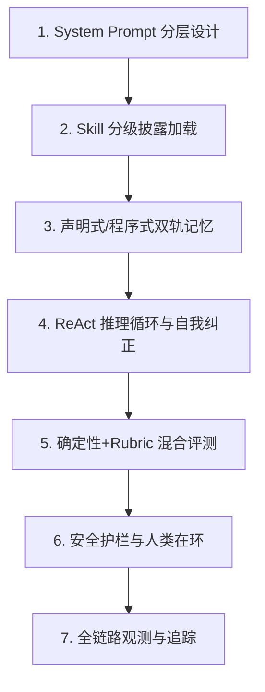

# agent-learning

围绕 **自研高级 Agent** 的理论研究与工程落地实践。本项目不仅涵盖了 [Hermes Agent](https://github.com/NousResearch/hermes-agent) 的核心机制，还补齐了企业级 Agent 工程化所需的 **大脑编排、安全护栏、评测体系与全链路追踪**。

---

## 🚀 核心架构：Agent 五大支柱 + 工程层

自研 Agent 的理论核心可以总结为“5+1”模型，本项目通过 📄**文档** + 🚀**可运行 Demo** 对其进行了深度还原。

### 1. 内核层 (Core Pillars)
*   **Memory (会话与记忆)**：[docs/hermes-session-context-management.md](docs/hermes-session-context-management.md)
    *   *Demo*: `demos/hermes-session-context-management/` (Prefix Cache、分级披露、双轨记忆)
*   **Tools (技能加载)**：[docs/hermes-skill-dynamic-loading.md](docs/hermes-skill-dynamic-loading.md)
    *   *Demo*: `demos/hermes-skill-loader/` (Tier-0 索引、按需加载详情)
*   **Brain (编排循环)**：[docs/agent-core-reasoning-loop.md](docs/agent-core-reasoning-loop.md)
    *   *Demo*: `demos/hermes-orchestration-loop/` (ReAct 推理循环、Self-Correction 自动纠错)

### 2. 治理与工程层 (Governance & Engineering)
*   **Eval (多维评测)**：[docs/agent-evaluation.md](docs/agent-evaluation.md)
    *   *Demo*: `demos/agent-evaluation/` (面对**非确定性、黑盒化、错误级联放大**的三类评委体系)
*   **Safety (安全护栏)**：[docs/agent-guardrails.md](docs/agent-guardrails.md)
    *   *Demo*: `demos/agent-guardrails/` (输入拦截、HITL 人类在环、Token 预算控制)
*   **Observability (全链路追踪)**：[docs/agent-observability.md](docs/agent-observability.md)
    *   *Demo*: `demos/agent-observability/` (Trace ID、Span 结构化日志、事故复盘分析)

---

## 📖 推荐学习路径



1.  **入门 (1-3)**：建立「Prompt 拼装 + 工具按需加载」的基础认知。
2.  **进阶 (4)**：理解 Agent 如何通过 While 循环自主解决问题并修正错误。
3.  **工业化 (5-7)**：学习如何让 Agent 在生产环境中稳定、安全、可监控。

---

## 🛠️ Demo 快速开始

环境要求：**Python 3.10+**，无第三方依赖。

### 核心编排与自动纠错
```bash
# 观察 Agent 在工具报错时如何通过 Thought 修正自己
python demos/hermes-orchestration-loop/demo.py
```

### 安全护栏与 HITL
```bash
# 体验拦截恶意注入，并在敏感操作时手动批准 (yes/no)
python demos/agent-guardrails/demo.py
```

### 全链路追踪
```bash
# 运行并生成结构化的 agent_execution_trace.json 审计日志
python demos/agent-observability/demo.py
```

### 混合评测指标
```bash
# 模拟多次运行并计算 pass@k 等关键量化指标
python demos/agent-evaluation/evaluator.py
```

---

## 🎯 解决的核心痛点

| 痛点 | 解决方案 | 对应模块 |
|------|----------|----------|
| **非确定性** | 通过多次试验计算 `pass@k` 概率 | `agent-evaluation` |
| **黑盒化** | 结构化 Trace 记录每一步 Thought/Action | `agent-observability` |
| **错误级联放大** | 将报错转化为 Observation 触发 Self-Correction | `hermes-orchestration-loop` |
| **上下文溢出** | 采用 Progressive Disclosure 分级披露与 Prefix Cache | `hermes-session-context-management` |
| **删库跑路风险** | 执行护栏拦截敏感 Action 并触发人类确认 (HITL) | `agent-guardrails` |

---
*最后更新：2026-06-17*
